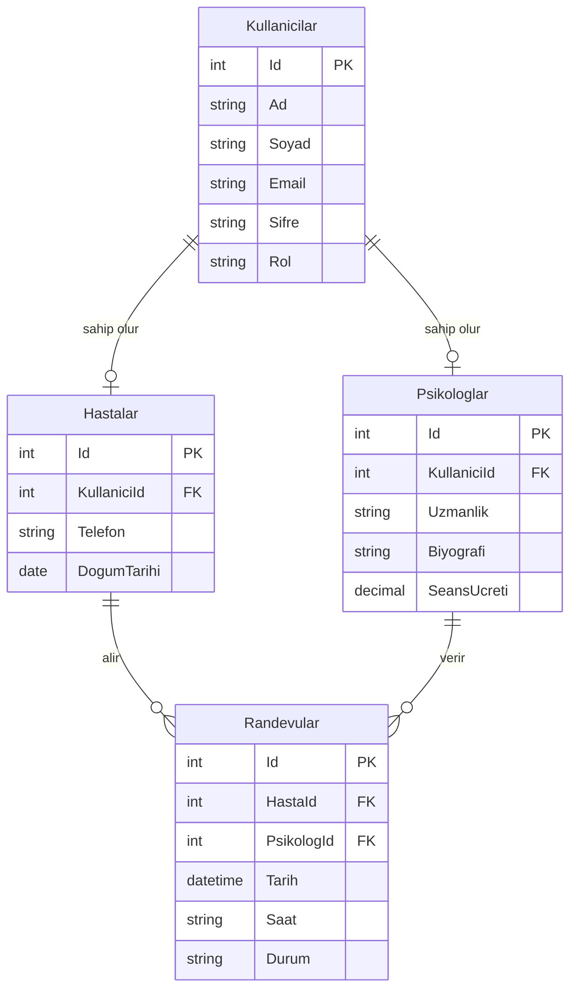

# Psikoloji Randevu Sistemi

ASP.NET Core ile geliştirilmiş psikoloji randevu yönetim sistemi.

## Tablolar

- **Kullanicilar** - Sisteme kayıtlı tüm kullanıcılar (Hasta/Psikolog/Admin)
- **Psikologlar** - Psikolog profil bilgileri
- **Hastalar** - Hasta profil bilgileri
- **Randevular** - Randevu kayıtları

## Tablolar Arası İlişkiler (ER Diyagramı)

## Teknolojiler

- ASP.NET Core MVC
- Entity Framework Core
- SQL Server (SSMS)
- Bootstrap
